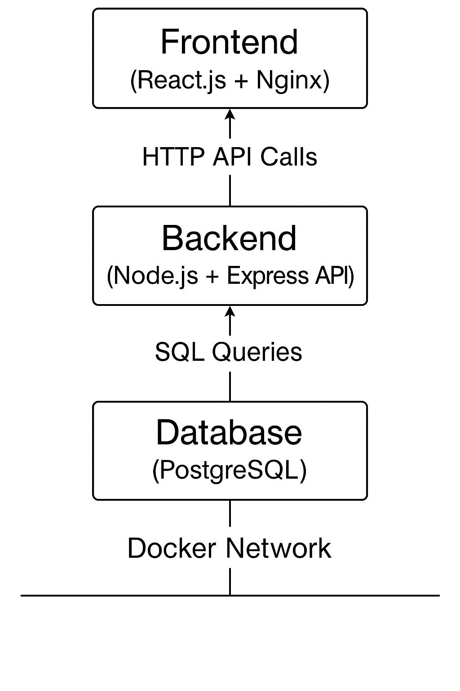
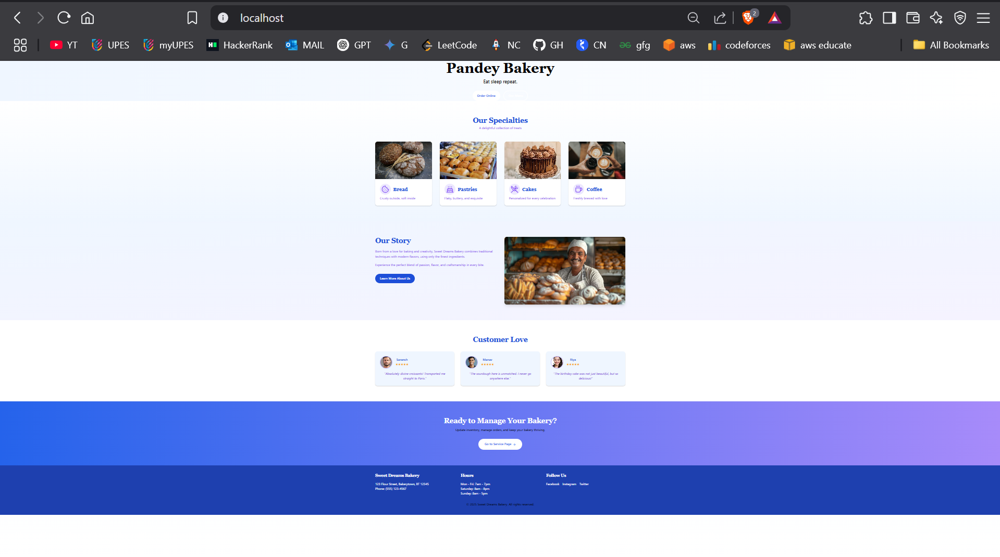
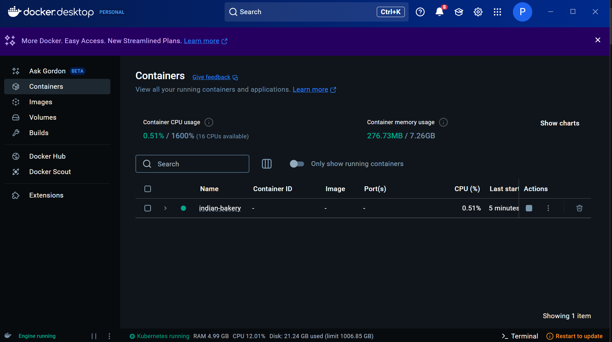

# Pandey Bakery

Welcome to the Bakery Management System! This application is designed to streamline inventory management for bakeries using a modern microservices architecture. Whether you're managing cakes, pastries, or bread, this system helps you keep track of your sweet business efficiently!

## Features

- **Real-time Inventory Management**: Get instant updates on stock levels across all services.
- **Microservices Architecture**: Each component runs independently, allowing for easy scaling and maintenance.
- **Mobile Responsive**: Access the system from any device with a responsive design.
- **Order Online** : You can even order from our website(Coming soon!)

## System Architecture


## Technology Stack

- **Frontend**: React, Tailwind CSS
- **API Layer**: Node.js, Express
- **Database**: PostgreSQL
- **Messaging**: RabbitMQ
- **Containerization**: Docker, Docker Compose

## Getting Started

Follow these steps to set up the Bakery Management System on your local machine.

### 1. Clone the Repository

```bash
git clone https://github.com/Yash-pandey19/Indian-Bakery.git
cd Indian-Bakery
```
### 2. **Launch Services** ✨
```bash
docker-compose up --build -d
```

### 3. **Access Application** 
```
http://localhost:80
```


## Final Output 





## Small Explaaination Video 
```
https://youtu.be/yXPUUU5XfG4

```
## Contribution Welcome!

1. Fork the repository
2. Create your feature branch
3. Add your improvements
4. Open a Pull Request
